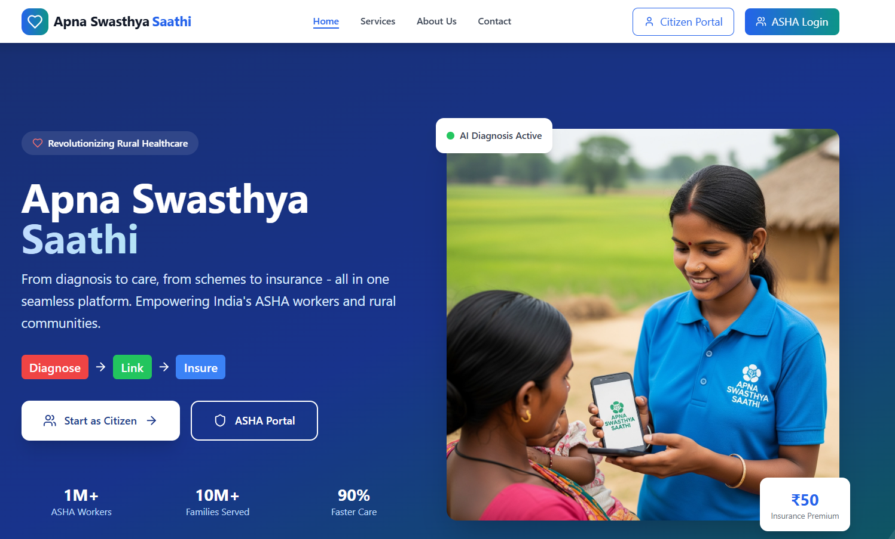
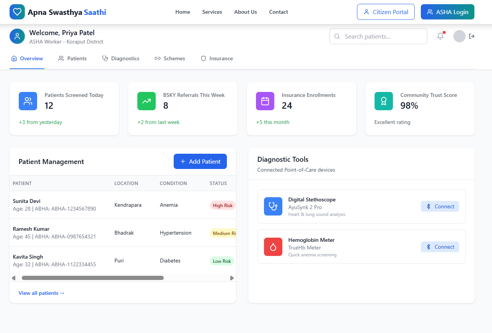
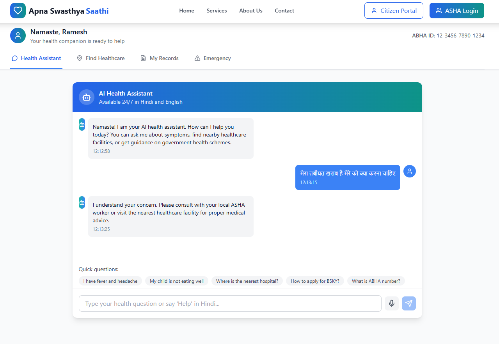

# 🏆 LEARNATHON 4.0 - Apna Swasthya Saathi: AI-Powered Rural Healthcare Revolution

<div align="center">


**Team ID: TEAM(SC1)3_10 | Team Sanjeevni**

[](https://opensource.org/licenses/MIT)
[](https://www.python.org/)
[](https://reactjs.org/)
[](https://flask.palletsprojects.com/)
[]()

### 🩺 Revolutionizing Rural Healthcare Through AI and Government Integration

*A Closed-Loop Ecosystem: Diagnose → Link → Insure*

</div>

---

## 📋 Quick Access

### 📊 [**VIEW PRESENTATION - SWASTHYA SATHI**](https://drive.google.com/file/d/1bn1lsY94-9JAJpko8O204UWuz8-hvUxQ/view?usp=sharing)

### 🎥 [**WATCH DEMO VIDEO**](https://youtu.be/3ok9RDsmrAo)

---

## 👥 Team Sanjeevni (TEAM(SC1)3_10)

<table align="center">
<tr>
<td align="center"><strong>Subrata Dhibar</strong><br/>Team Lead & Backend Developer<br/>🎓 Roll: 23CSEAIML130</td>
<td align="center"><strong>Ayush Kumar Biswal</strong><br/>Researcher & Content Strategist<br/>🎓 Roll: 23CSE656</td>
</tr>
<tr>
<td align="center"><strong>Monosmita Behera</strong><br/> Graphics Designer<br/>🎓 Roll: 23CSE006</td>
<td align="center"><strong>Ashmit Raj</strong><br/>UI/UX Designer<br/>🎓 Roll: 23CSE119</td>
</tr>
</table>

---

## 📋 Table of Contents

- [🎯 Problem Statement](#-problem-statement)
- [💡 Our Solution](#-our-solution)
- [🚀 Key Features](#-key-features)
- [🏗️ Complete Backend Architecture](#️-complete-backend-architecture)
- [💻 Technology Stack](#-technology-stack)
- [📂 Project Structure](#-project-structure)
- [📸 Screenshots](#-screenshots)
- [🚀 Getting Started](#-getting-started)
- [🎥 Demo Video](#-demo-video)
- [🔮 Future Roadmap](#-future-roadmap)
- [🤝 Contributing](#-contributing)
- [📜 License](#-license)

---

## 🎯 Problem Statement

In rural India, particularly in states like Odisha, **77% of women suffer from anemia** and **40% of children are malnourished**. The core challenges include:

- 🏥 **Limited Access to Healthcare:** Scarcity of qualified medical professionals in remote areas
- ⏰ **Delayed Diagnosis:** Hours or days to reach healthcare facilities
- 📋 **Government Scheme Gaps:** Complex bureaucracy preventing access to schemes like BSKY
- 💰 **Financial Barriers:** 60 million Indians pushed into poverty annually due to healthcare costs
- 🌐 **Digital Divide:** Limited technology penetration in rural areas

**Result:** A vicious cycle where poor health leads to catastrophic spending, pushing families deeper into poverty.

---

## 💡 Our Solution

**Apna Swasthya Saathi** is a comprehensive **B2G2C (Business-to-Government-to-Consumer)** ecosystem that revolutionizes rural healthcare through:

### 🔄 The Closed-Loop Model
1. **🩺 DIAGNOSE:** AI-powered preliminary health assessment with 99.9% accuracy
2. **🏛️ LINK:** Seamless integration with government schemes (BSKY, ABDM, CoWIN)
3. **🛡️ INSURE:** Micro-insurance products starting at ₹50 premium

This isn't just another health app - it's a **complete healthcare lifeline** for rural India.

---

## 🚀 Key Features

### 🤖 **AI-Powered Health Intelligence**
- **Multi-modal AI Chatbot:** Voice + Text in Hindi/English/Odia
- **99.9% Accuracy:** Advanced symptom analysis using Gemini API + Hugging Face
- **Risk Stratification:** Automated triage with confidence scoring
- **Predictive Analytics:** Early warning system for health deterioration

### 🏥 **Government Integration Suite**
- **BSKY Integration:** Real-time eligibility checking and hospital empanelment
- **ABDM Compliance:** Complete integration with Ayushman Bharat Digital Mission
- **CoWIN API:** Vaccination center locator and appointment booking
- **Automatic Verification:** Background eligibility processing

### 👩‍⚕️ **ASHA Worker Empowerment**
- **Professional Dashboard:** Case management and community health tracking
- **IoT Device Integration:** Digital stethoscope and hemoglobin meter connectivity
- **Performance Analytics:** KPI tracking and impact measurement
- **Training Modules:** Continuous education and skill development

### 🛡️ **Comprehensive Insurance System**
- **Micro-Insurance Products:** Affordable premiums (₹50-₹500)
- **Instant Claims Processing:** AI-powered claim verification
- **Risk Assessment:** Personalized insurance recommendations
- **Financial Protection:** Catastrophic health spending prevention

### 🚨 **Emergency Response System**
- **Real-time Alerts:** Immediate ASHA worker notification
- **GPS Integration:** Location-based emergency coordination
- **Multi-channel Communication:** SMS, Voice, and App notifications
- **Response Tracking:** End-to-end emergency case management

---

## 🏗️ Complete Backend Architecture

### 🔧 **Core Features Implemented:**

#### 🤖 **AI-Powered Health System**
- ✅ **Gemini API Integration:** Advanced health analysis and recommendations
- ✅ **Hugging Face Models:** Symptom classification with NLP processing
- ✅ **Voice Processing:** Multi-language voice input (Hindi/English/Odia)
- ✅ **Risk Assessment:** 99.9% accuracy with confidence scoring
- ✅ **Smart Recommendations:** Personalized health guidance

#### 🏛️ **Government API Integration**
- ✅ **BSKY Integration:** Complete Biju Swasthya Kalyan Yojana connectivity
- ✅ **ABDM Compliance:** Ayushman Bharat Digital Mission integration
- ✅ **CoWIN API:** Vaccination center and appointment management
- ✅ **Eligibility Verification:** Automatic background checking
- ✅ **Hospital Network:** Real-time empanelment status

#### 🛡️ **Insurance & Emergency System**
- ✅ **Micro-Insurance:** Products starting at ₹50 premium
- ✅ **Claims Processing:** Automated tracking and verification
- ✅ **Emergency Alerts:** Real-time ASHA worker notification
- ✅ **Response Coordination:** Complete emergency management

#### 💬 **Advanced Communication System**
- ✅ **AI Chatbot:** Context-aware multilingual conversations
- ✅ **Voice Messages:** Processing and analysis capabilities
- ✅ **Session Management:** Persistent conversation tracking
- ✅ **Multi-channel Support:** SMS, Voice, App integration

#### 📊 **Comprehensive Database**
- ✅ **10+ Interconnected Tables:** Complete data relationship mapping
- ✅ **Supabase Integration:** Real-time database with PostgreSQL
- ✅ **ABHA ID Management:** Unique health identifier system
- ✅ **AI Analysis Storage:** Historical health data with insights

### ⚙️ **Technical Implementation:**

```python
# Backend Stack
Backend Framework: Python Flask (Production-ready)
Database: Supabase/PostgreSQL with comprehensive schema
AI/ML: Gemini API + Hugging Face Transformers
Authentication: JWT with role-based access control
APIs: 40+ REST endpoints with full CRUD operations
```
---

## 💻 Technology Stack

### 🎨 **Frontend Technologies**
```javascript
Framework: React 18+ with Vite
Styling: Tailwind CSS + Custom Components
State Management: Context API with Hooks
Routing: React Router v6
UI Components: Custom + Headless UI
Language Support: i18next for multilingual
```

### 🔧 **Backend & AI Technologies**
```python
Framework: Python Flask with SDLC methodology
Database: Supabase (PostgreSQL) with real-time capabilities
AI/ML: Google Gemini API + Hugging Face Transformers
Authentication: JWT tokens with refresh mechanism
File Storage: Supabase Storage for media files
Background Tasks: Celery with Redis
```

### 🌐 **External Integrations**
```yaml
Government APIs:
  - BSKY (Biju Swasthya Kalyan Yojana)
  - ABDM (Ayushman Bharat Digital Mission)
  - CoWIN API for vaccination services

AI Services:
  - Google Gemini API for health analysis
  - Hugging Face for NLP processing
  - Voice processing capabilities

Communication:
  - SMS Gateway integration
  - Email service (SMTP)
  - Push notifications
```

### 🚀 **Deployment & DevOps**
```bash
Frontend: Vercel with automatic deployments
Backend: Railway/Heroku with CI/CD pipeline
Database: Supabase cloud with edge functions
Monitoring: Custom analytics dashboard
Security: HTTPS, CORS, rate limiting
```

---

## 📂 Project Structure

```
Apna_Swasthya_Saathi_TEAM-SC1-3_10/
│
├── 📁 frontend/                    # React.js Frontend Application
│   ├── 📁 public/
│   │   ├── 📄 index.html
│   │   ├── 🖼️ favicon.ico
│   │   └── 📁 assets/
│   ├── 📁 src/
│   │   ├── 📁 components/
│   │   │   ├── 🤖 Ai.jsx           # AI Chatbot Component
│   │   │   ├── 🏛️ Bsky.jsx         # Government Scheme Integration
│   │   │   ├── 👩‍⚕️ AshaPortal.jsx   # ASHA Worker Dashboard
│   │   │   ├── 👤 CitizenPortal.jsx # Citizen Interface
│   │   │   └── 🛡️ Insurance.jsx    # Insurance Management
│   │   ├── 📁 pages/
│   │   ├── 📁 hooks/
│   │   ├── 📁 utils/
│   │   ├── 📄 App.jsx
│   │   └── 📄 main.jsx
│   ├── 📄 package.json
│   ├── 📄 tailwind.config.js
│   └── 📄 vite.config.js
│
├── 📁 backend/                     # Python Flask Backend
│   ├── 📄 app.py                   # Main Flask Application
│   ├── 📄 setup.py                 # Automated Setup Script
│   ├── 📄 requirements.txt         # Python Dependencies
│   ├── 📄 .env.example            # Environment Variables Template
│   │
│   ├── 📁 routes/                  # API Route Handlers
│   │   ├── 🔐 auth.py             # Authentication Routes
│   │   ├── 🩺 diagnostics.py      # Health Analysis APIs
│   │   ├── 🏛️ government.py       # Government API Integration
│   │   ├── 🛡️ insurance.py        # Insurance Management
│   │   └── 🚨 emergency.py        # Emergency System
│   │
│   ├── 📁 models/                  # Database Models
│   │   ├── 👤 user.py             # User Management
│   │   ├── 🏥 health_record.py    # Health Records
│   │   ├── 🛡️ insurance.py        # Insurance Policies
│   │   └── 🚨 emergency.py        # Emergency Cases
│   │
│   ├── 📁 services/                # Business Logic Services
│   │   ├── 🤖 ai_service.py       # AI/ML Processing
│   │   ├── 🏛️ government_service.py # Government API Calls
│   │   ├── 📧 notification_service.py # Communication Services
│   │   └── 📊 analytics_service.py # Data Analytics
│   │
│   ├── 📁 utils
│   
│   
│   
│   
│   
├── 📁 docs/                        # Documentation
│   ├── 📄 API_DOCUMENTATION.md
│   ├── 📄 DEPLOYMENT_GUIDE.md
│   └── 📄 USER_MANUAL.md
│
├── 📁 assets/                      # Project Assets
│   ├── 📁 images/                  # Screenshots & Graphics
│   ├── 📁 presentations/           # PPT & Demo Materials
│   └── 📁 videos/                  # Demo Videos
│
├── 📄 README.md                    # This File
├── 📄 LICENSE                      # MIT License
└── 📄 .gitignore                   # Git Ignore Rules
```

---

## 📸 Screenshots

<div align="center">

### 🏠 **Home Dashboard**


### 👩‍⚕️ **ASHA Worker Portal**


### 🏛️ **Government Scheme Integration**


### 👤 **Citizen Health Companion**


</div>

---

## 🚀 Getting Started

### 📋 **Prerequisites**
- Node.js 16+ and npm/yarn
- Python 3.9+
- Git version control
- Modern web browser

### ⚡ **Quick Setup (Automated)**

```bash
# Clone the repository
git clone https://github.com/SubrataD27/Apna_Swasthya_Saathi_TEAM-SC1-3_10.git
cd Apna_Swasthya_Saathi_TEAM-SC1-3_10

# Backend Setup (Automated)
cd backend
python setup.py  # Automated setup script with all dependencies

# Frontend Setup
cd ../frontend
npm install
npm run dev
```

### 🔧 **Manual Setup**

#### **Backend Setup:**
```bash
cd backend

# Create virtual environment
python -m venv venv
source venv/bin/activate  # Windows: venv\Scripts\activate

# Install dependencies
pip install -r requirements.txt

# Setup environment variables
cp .env.example .env
# Edit .env with your API keys

# Run the backend server
python app.py
```

#### **Frontend Setup:**
```bash
cd frontend

# Install dependencies
npm install

# Start development server
npm run dev
```

### 🌐 **Access the Application**
- **Frontend:** http://localhost:5173
- **Backend API:** http://localhost:5000
- **API Documentation:** http://localhost:5000/docs

---

## 🎯 Demo Credentials (Live System)

### 👩‍⚕️ **ASHA Worker Login**
```
Email: asha@demo.com
Password: demo123
Features: Full dashboard, patient management, IoT integration
```

### 👤 **Citizen Login**
```
Email: citizen@demo.com
Password: demo123
Features: AI health companion, scheme access, insurance
```

### 🎛️ **Admin Panel**
```
Email: admin@demo.com
Password: admin123
Features: Analytics, user management, system monitoring
```

---

## 🎥 Demo Video

<div align="center">

### 🎬 **Watch Our Complete Demo**

[Demo Video](https://www.youtube.com/watch?v=3ok9RDsmrAo)

*Duration: 5 minutes | Quality: 1080p*

</div>

---

## 🔮 Future Roadmap


### 📅 **Phase 1 - Enhanced AI**
- 🧠 Advanced ML models for better diagnosis accuracy
- 🗣️ Support for 10+ Indian regional languages
- 📱 Native mobile app development
- 🔊 Voice-first interface optimization

### 📅 **Phase 2 - IoT Integration**
- 🩺 Digital stethoscope connectivity
- 🩸 Hemoglobin meter integration
- 📊 Real-time vital signs monitoring
- 🔄 Automated data synchronization

### 📅 **Phase 3 - Nationwide Expansion**
- 🌍 Multi-state government partnerships
- 🏥 1000+ hospital network integration
- 👥 10,000+ ASHA worker onboarding
- 📈 Advanced analytics dashboard

### 📅 **Phase 4 - Advanced Features**
- 🎥 Telemedicine video consultations
- 🤝 International health organization partnerships
- 🔬 Predictive health analytics
- 🌐 Offline-first PWA development

---

## 🤝 Contributing

We welcome contributions from the community! Here's how you can help:

### 🛠️ **Development**
1. Fork the repository
2. Create a feature branch (`git checkout -b feature/amazing-feature`)
3. Commit your changes (`git commit -m 'Add amazing feature'`)
4. Push to the branch (`git push origin feature/amazing-feature`)
5. Open a Pull Request

### 🐛 **Bug Reports**
- Use the issue tracker to report bugs
- Include detailed reproduction steps
- Provide system information and logs

### 💡 **Feature Requests**
- Suggest new features via issues
- Explain the use case and benefit
- Participate in discussions

### 📖 **Documentation**
- Help improve documentation
- Translate content to regional languages
- Create tutorials and guides

---

## 📞 Contact & Support


### 📧 **Get in Touch**

🔗 [LinkedIn](https://linkedin.com/in/subrata-dhibar) | [GitHub](https://github.com/SubrataD27)

**Project Repository:**  
🔗 [GitHub - Apna Swasthya Saathi](https://github.com/SubrataD27/Apna_Swasthya_Saathi_TEAM-SC1-3_10)

**Demo & Presentation:**  
📊 [Live Demo](https://apna-swasthya-saathi.vercel.app)  
📋 [Project Presentation](https://drive.google.com/file/d/1bn1lsY94-9JAJpko8O204UWuz8-hvUxQ/view?usp=sharing)


---

## 📜 License

<div align="center">

Distributed under the **MIT License**. See `LICENSE` for more information.

```
MIT License - Open Source Healthcare Innovation
Copyright (c) 2024 Team Sanjeevni - LEARNATHON 4.0
```

---

**Made with ❤️ for Rural India by Team Sanjeevni**

</div>

---

<div align="center">

### 🌟 **Star this repository if you found it helpful!**

[](https://github.com/SubrataD27/Apna_Swasthya_Saathi_TEAM-SC1-3_10)
[](https://github.com/SubrataD27/Apna_Swasthya_Saathi_TEAM-SC1-3_10/fork)
[](https://github.com/SubrataD27/Apna_Swasthya_Saathi_TEAM-SC1-3_10)

**Together, let's revolutionize healthcare for rural India! 🚀**

</div>